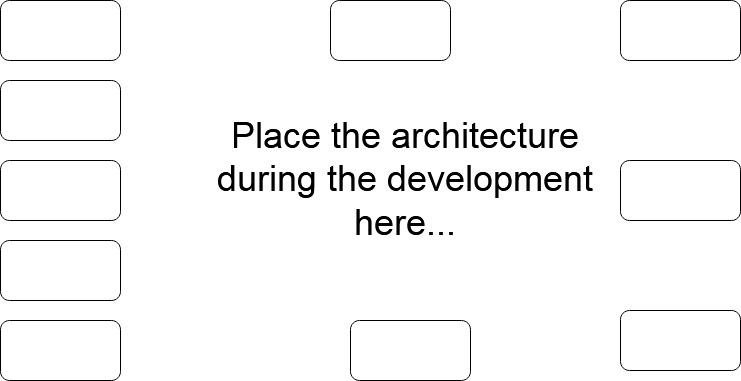

# Dynamic Dashboard with AngularJS

This repo will host a Single-Page AngularJS App dashboard.
The repo is using karma and jasmine for testing and also eslint for static code analysis to provide code quality.

### Dependencies
See the `package.json` file.
### Installation instructions.
Commands,
1. git clone `this repo`
2. cd in the folder of `this repo`
3. execute `npm install`
4. ....
5. execute `gulp dev`

### Dashboard features.
1. Simple layout
2. Graphs & Visualizations
3. 

### Architecture.

### Documentation & Information
Have a look in the `./docs` directory

### Testing & Coverage
1. Run static code analysis for quality of code with `npm run lint`
    1. Check the html reporting page of the static code analysis results in `./static_code_analysis.html`
2. Run the test for the web app with `npm test`